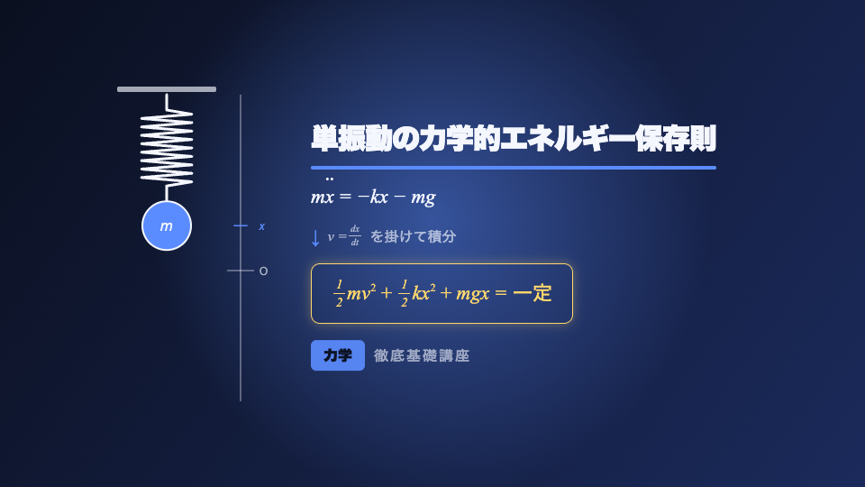

# Remotion Playground

React で動画をつくる [Remotion](https://www.remotion.dev/) の実験環境です。
このリポジトリでは物理講義の導入カット `PhysicsLecture` を題材に、Remotion の基本的な使い方を一通りなぞれるようにしてあります。



*`PhysicsLecture` の 100 フレーム目。左のばね振り子は実際に単振動しています。*

## 目次

- [セットアップ](#セットアップ)
- [Studio で作業する](#studio-で作業する)
- [動画を書き出す](#動画を書き出す)
- [props を差し替えて量産する](#props-を差し替えて量産する)
- [実例で読む: PhysicsLecture の構造](#実例で読む-physicslecture-の構造)
- [Remotion の中核 API](#remotion-の中核-api)
- [いちばん大事な原則](#いちばん大事な原則)
- [新しい動画を追加する](#新しい動画を追加する)
- [共通部品](#共通部品)
- [コマンド一覧](#コマンド一覧)
- [トラブルシュート](#トラブルシュート)

## セットアップ

```bash
npm install
```

初回のレンダリング時に Chrome Headless Shell（約 150MB）が自動でダウンロードされます。

動作確認:

```bash
npm run typecheck
npx remotion compositions
```

## Studio で作業する

```bash
npm run dev
```

ブラウザで Remotion Studio が開きます。ここが作業の中心です。

| 場所 | 内容 |
| --- | --- |
| 左 | コンポジション一覧。クリックで切り替え |
| 下 | タイムライン。`スペース` で再生、`←` `→` で 1 コマ送り |
| 右 | Props パネル。zod スキーマから自動生成された GUI |

コードを保存すると即座にホットリロードされます。

Props パネルでタイトルや色を調整したあと **Save** を押すと、その値が `defaultProps` としてソースコードに書き戻されます。`PhysicsLecture` なら `src/compositions/PhysicsLecture/schema.ts` が更新されます。

## 動画を書き出す

```bash
npm run render:physics
```

実体は次のコマンドです。

```bash
npx remotion render PhysicsLecture out/physics-lecture.mp4
```

### よく使うオプション

| 用途 | オプション |
| --- | --- |
| 確認用に軽く書き出す | `--scale=0.25` |
| 一部のフレームだけ | `--frames=0-30` |
| 品質を上げる（小さいほど高品質） | `--crf=18` |
| 透過つき WebM | `--codec=vp8 --image-format=png` |
| GIF | 出力先を `out/x.gif` にして `--every-nth-frame=2` |
| 連番 PNG | 出力先をディレクトリにして `--sequence` |

### 静止画 1 枚だけ

調整中はこちらのほうが速く、数秒で結果が見られます。

```bash
npx remotion still PhysicsLecture out/thumb.png --frame=100
```

`--frame` で好きな瞬間を切り出せます。上のプレビュー画像もこの方法で作りました。

## props を差し替えて量産する

同じコンポジションに別の値を流し込めば、別の動画になります。

```bash
npx remotion render PhysicsLecture out/lesson2.mp4 --props='{
  "title": "単振り子の周期",
  "courseLabel": "力学",
  "courseSubLabel": "応用編",
  "accentColor": "#ff6b6b",
  "highlightColor": "#ffd76b"
}'
```

JSON ファイルからも渡せます。

```bash
npx remotion render PhysicsLecture out/lesson2.mp4 --props=./props/lesson2.json
```

props は zod スキーマで検証されるため、キー名や型を間違えるとレンダリング前にエラーになります。

```ts
// src/compositions/PhysicsLecture/schema.ts
export const physicsLectureSchema = z.object({
  title: z.string().min(1).max(40),
  courseLabel: z.string().max(20),
  courseSubLabel: z.string().max(30),
  accentColor: zColor(),
  highlightColor: zColor(),
})
```

`zColor()` を使うと、Studio の Props パネルにカラーピッカーが出ます。

## 実例で読む: PhysicsLecture の構造

「単振動の力学的エネルギー保存則」を 5 秒で紹介するカットです。左でばね振り子が振動し、右で運動方程式から保存則までが順に展開されます。

```
src/compositions/PhysicsLecture/
├── PhysicsLecture.tsx    本体。全体のレイアウトと組み立て
├── schema.ts             zod スキーマと defaultProps
├── timing.ts             各要素が出てくるフレーム
├── SpringMass.tsx        単振動するばね振り子（SVG）
├── springPath.ts         ばねのジグザグ座標を生成する純関数
├── TitleBar.tsx          タイトルと、引かれていく下線
├── HighlightBox.tsx      結論の式を囲む枠
├── CourseBadge.tsx       画面下部の講座ラベル
└── formulas/
    ├── EquationOfMotion.tsx     mẍ = −kx − mg
    ├── TransformNote.tsx        ↓ v = dx/dt を掛けて積分
    └── EnergyConservation.tsx   ½mv² + ½kx² + mgx = 一定
```

### 時間の設計を 1 ファイルに集める

「何フレーム目に何が出るか」は `timing.ts` にまとめてあります。タイミング調整はここだけを触れば済みます。

```ts
// src/compositions/PhysicsLecture/timing.ts
export const CUES = {
  underline: 8,
  equationOfMotion: 22,
  transformNote: 40,
  energyConservation: 58,
  courseBadge: 88,
} as const

export const TOTAL_DURATION = seconds(5)
```

`seconds()` は `src/config/video.ts` のヘルパーで、秒数をフレーム数に変換します。`durationInFrames={150}` のようなマジックナンバーを書かずに済みます。

### 出現アニメーションはフックで再利用する

各パーツは `delayInFrames` を受け取り、共通のフックでアニメーションします。

```tsx
// PhysicsLecture.tsx より
const noteAnimation = useFadeInUp({
  delayInFrames: CUES.transformNote,
  distance: 20,
})

<div style={noteAnimation}>
  <TransformNote fontSize={fontSize.body} accentColor={accentColor} />
</div>
```

`useFadeInUp` は `{ opacity, transform }` を返すだけの薄いフックです（`src/animations/useFadeInUp.ts`）。中身は `spring()` の進捗値を `interpolate()` で不透明度と移動量に変換しているだけです。

### 実際に振動させる

ばね振り子は見た目だけのループ画像ではなく、変位を三角関数で計算しています。数式の `x` と画面の動きが対応します。

```tsx
// src/compositions/PhysicsLecture/SpringMass.tsx
const frame = useCurrentFrame()
const { fps } = useVideoConfig()

const displacement =
  amplitude * Math.sin((2 * Math.PI * frequency * frame) / fps)
const massY = EQUILIBRIUM_Y + displacement
```

コイルの座標生成は `springPath.ts` に純関数として切り出してあり、巻き数を保ったまま間隔だけを伸縮させます。

### 数式は自前の小さな部品で組む

LaTeX ライブラリは入れていません。`src/components/math/` の 4 つの部品で組み立てています。

| 部品 | 役割 |
| --- | --- |
| `MathRow` | 数式 1 行のコンテナ。フォントとベースライン揃え |
| `Fraction` | 分数。親の font-size に対する相対サイズで組む |
| `Sup` | 指数などの上付き文字 |
| `Dotted` | ニュートン記法のドット（`ẍ` の点） |

`Dotted` を自作しているのは、合成済み Unicode の `ẍ` がフォントによっては欠けるためです。点を自前で重ねることで、レンダリング環境に依存しなくなります。

## Remotion の中核 API

| API | 役割 | このリポジトリでの使用箇所 |
| --- | --- | --- |
| `useCurrentFrame()` | 現在のフレーム番号 | すべてのアニメーションの起点 |
| `useVideoConfig()` | fps / 幅 / 高さ / 尺 | `SpringMass.tsx`, `useSpringIn.ts` |
| `interpolate()` | 値の線形マッピング | `useFadeInUp.ts`, `TitleBar.tsx` |
| `spring()` | バネ物理による自然な動き | `useSpringIn.ts` |
| `<AbsoluteFill>` | 画面全体に重ねる | `Stage.tsx`, 各コンポジション |
| `<Series>` | シーンを順番に並べる | `ProductPromo.tsx` |
| `<Sequence>` | 時間をずらして表示する | `ProductPromo.tsx` |

## いちばん大事な原則

**`useState` や `setTimeout` でアニメーションしてはいけません。**

Remotion は各フレームを独立に、並列でレンダリングします。フレーム 100 が、フレーム 99 より先に描かれることもあります。したがって「前のフレームからの積み上げ」で状態を持つと破綻します。

「今何フレーム目か」から見た目を純関数的に決めるのが唯一の正解です。

```tsx
// NG: 状態の積み上げでアニメーションする
const [x, setX] = useState(0)
useEffect(() => { setX(x + 1) })

// OK: フレーム番号から計算する
const frame = useCurrentFrame()
const x = interpolate(frame, [0, 30], [0, 100])
```

## 新しい動画を追加する

1. `src/compositions/YourVideo/` を作る
2. `schema.ts` に zod スキーマと `defaultProps` を書く
3. `YourVideo.tsx` を書く（中身は普通の React コンポーネント）
4. `src/Root.tsx` に `<Composition>` を追加する

```tsx
// src/Root.tsx
<Composition
  id="PhysicsLecture"
  component={PhysicsLecture}
  durationInFrames={TOTAL_DURATION}
  fps={FPS}
  width={DIMENSIONS.landscape.width}
  height={DIMENSIONS.landscape.height}
  schema={physicsLectureSchema}
  defaultProps={physicsLectureDefaultProps}
/>
```

`Root.tsx` に足すだけで、Studio と CLI の両方に出てきます。

### props から尺を決める

`calculateMetadata` を使うと、props の内容に応じて動画の長さを変えられます。`ProductPromo` が実例で、`features` を 1 つ増やすと自動的に尺が伸びます。

```tsx
calculateMetadata={({ props }) => ({
  durationInFrames: calculateTotalDuration(props),
})}
```

### 登録済みのコンポジション

| ID | 解像度 | 尺 | 内容 |
| --- | --- | --- | --- |
| `PhysicsLecture` | 1920x1080 | 5.00s | 単振動の力学的エネルギー保存則 |
| `HelloWorld` | 1920x1080 | 5.00s | 最小構成の例 |
| `ProductPromo` | 1920x1080 | 可変 | `Series` と `calculateMetadata` の例 |
| `ProductPromoVertical` | 1080x1920 | 可変 | 同上の縦型 |

## 共通部品

```
src/
├── config/video.ts       FPS・解像度・seconds() ヘルパー
├── theme/
│   ├── colors.ts         配色
│   └── typography.ts     フォントとサイズスケール
├── animations/
│   ├── useSpringIn.ts    0 から 1 へ向かうバネの進捗値
│   ├── useFadeInUp.ts    下からふわっと現れる
│   └── useFadeOutAtEnd.ts  末尾でフェードアウトする不透明度
└── components/
    ├── Stage.tsx         黒地 + 末尾フェード。全コンポジションの土台
    ├── GradientBackground.tsx
    ├── Center.tsx
    └── math/             数式表示の部品
```

色・フォント・fps はすべて `theme/` と `config/video.ts` に集約してあります。コンポーネント側に直接書かないでください。

`Stage` は不透明な黒を敷いた上で中身をフェードさせます。これがないと、末尾のフェードアウトで背景が白く抜けます。

## コマンド一覧

| コマンド | 内容 |
| --- | --- |
| `npm run dev` | Studio を起動 |
| `npm run render:physics` | `PhysicsLecture` を書き出し |
| `npm run render:hello` | `HelloWorld` を書き出し |
| `npm run render:promo` | `ProductPromo` を書き出し |
| `npm run typecheck` | 型チェック |
| `npx remotion compositions` | 登録済みコンポジションと尺を一覧 |
| `npx remotion versions` | バージョン整合性をチェック |
| `npx remotion add <pkg>` | Remotion パッケージを正しいバージョンで追加 |

## トラブルシュート

### バージョン不整合

Remotion 関連のパッケージは、すべて同じバージョンに揃える必要があります。`zod` も Remotion 側が要求するバージョンに合わせます（現在は `4.4.3` に固定）。

```bash
npx remotion versions
```

`All packages have the correct version.` と出れば正常です。パッケージを追加するときは `npm install` ではなく次を使ってください。

```bash
npx remotion add <package-name>
```

### レンダリング結果が Studio と違う

Studio はブラウザのフォントを使いますが、レンダリングは Chrome Headless Shell を使います。フォントが環境に依存する場合は `@remotion/google-fonts` で明示的に読み込むか、`Dotted` のように描画を自前で組んでください。

### 末尾が白く抜ける

`Stage` で包み忘れています。`src/components/Stage.tsx` を参照してください。
